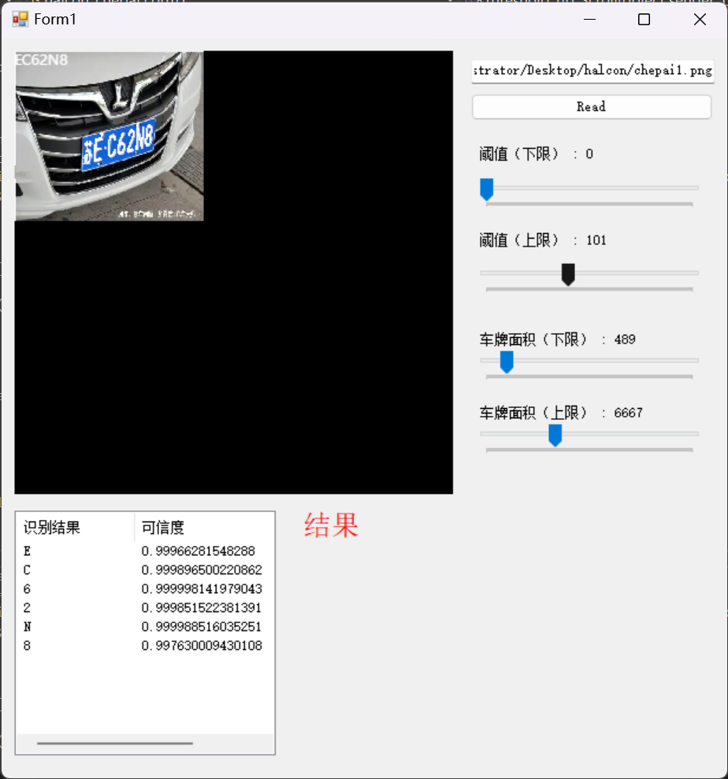
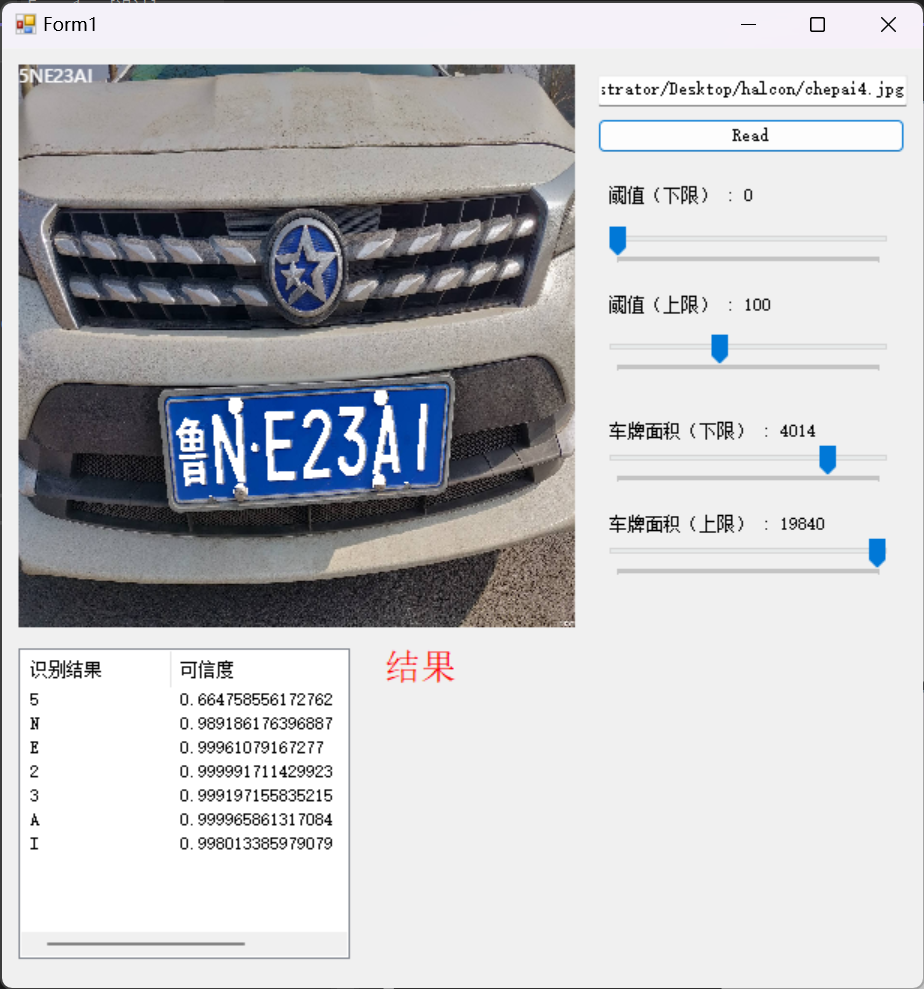

# 基于Halcon机器视觉的车牌识别

## 介绍
* 通过手动滑动阈值以及面积定位识别车牌
* 识别成功率高达90%
* 不支持识别中文，可通过训练模板定位识别

## Halcon关键代码
```
dev_close_window()

dev_clear_window()
read_image(image,'C:/Users/Administrator/Desktop/halcon/chepai4.jpg')
get_image_size(image, Width, Height)
dev_open_window_fit_size (0, 0, Width, Height, -1, -1, WindowHandle)
dev_display(image)
* 将图片转化为rgb三通道
decompose3(image, r, g, b)
* 转为hsv 色调 饱和度 明度值
trans_from_rgb(r, g, b, h, s, v, 'hsv')
* 提升图片对比度
emphasize(s, ImageEmphasize, Width, Height, 1)

threshold(ImageEmphasize, Region, 255, 255)

connection(Region, ConnectedRegions)

closing_rectangle1(ConnectedRegions, RegionClosing, 50, 50)

* 按照最大面积选
select_shape_std(RegionClosing, SelectedRegions, 'max_area', 70)
* 填充选出区域的孔洞
fill_up(SelectedRegions, RegionFillUp)
* 抠图
reduce_domain(ImageEmphasize, RegionFillUp, ImageReduced)
* 抠出原图
reduce_domain(image, RegionFillUp, ImageReduced1)
* 识别
threshold(ImageReduced, Region1, 0, 100)
* 打断连接区域
connection(Region1, ConnectedRegions1)
* 筛选显示区域
select_shape (ConnectedRegions1, SelectedRegions1, 'area', 'and', 4014, 19840.76)
* 排序区域
sort_region(SelectedRegions1, SortedRegions, 'character', 'true', 'row')
* 反转图片
invert_image(ImageReduced1, ImageInvert)
* 开始识别
read_ocr_class_mlp('Industrial_0-9A-Z_NoRej.omc', OCRHandle)
do_ocr_multi_class_mlp(SortedRegions, ImageInvert, OCRHandle, Class, Confidence)
```

## 截图


